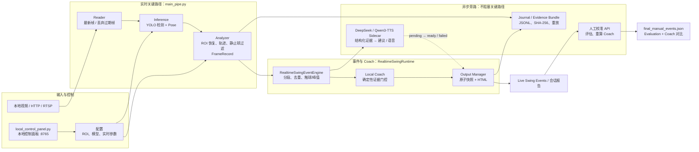

# Tennis Analyzer

`tennis_analyzer` 是一个面向网球训练视频的本地分析项目，重点能力是从单机位视频中提取人体姿态、网球、球拍、挥拍事件和面向 AI 网球教练的数据。当前主线分支是 `new`，已同步到远端 `origin-paused/new`。

## 系统架构

系统以 `main_pipe.py` 为唯一的分析入口：Reader、Inference 和 Analyzer 是受监督的
独立进程；挥拍事件、逐帧日志和本地 Coach 在 `RealtimeSwingRuntime` 中异步落盘；视频
渲染、DeepSeek 与人工校准均不阻塞检测/姿态推理关键路径。



| 层级 | 职责 | 关键产物 / 边界 |
| --- | --- | --- |
| 输入与控制 | 选择码流或视频、ROI、运行参数、启动/停止会话 | 控制面板仅监听 `127.0.0.1`；RTSP 凭据和 API Key 不写入报告或证据包。 |
| 实时关键路径 | 读取、检测、姿态、候选筛选、坐标恢复与 FrameRecord | 发生子进程异常即监督退出，避免静默卡死。 |
| 事件与本地 Coach | 挥拍分段、重叠去重、触球估计、确定性建议 | 本地 Coach 先于网络建议发布；仅使用通过证据门控的指标。 |
| 异步旁路 | DeepSeek、报告重绘、视频片段编码、日志、哈希、人工校准 | 延迟或失败不会阻塞下一帧推理，也不会覆盖原始事件快照。 |
| 可复核闭环 | 人工修正边界与漏检、计算 Precision/Recall/F1、重算 Coach | `final_events.json` 不变；确认完整视频前，评估状态保持 provisional。 |

每个会话拥有独立 `session_id` 和目录。事件 JSON / HTML 是兼容性快照，事件 JSONL 是
追加式历史；启用证据包时，`FrameRecord` JSONL 与事件快照构成最小可重放集合。重放验证
本地事件与 Coach 的稳定语义，不依赖原码流，也不复现 DeepSeek 的非确定性输出。

## 当前能力

- `main_pipe.py`：多进程视频检测流水线，生成标注视频、逐帧 JSON 和诊断 JSON。
- `yolo26n_unified_detector.py`：统一检测人、球、球拍，包含静止球抑制、镜中球过滤、轨迹连续性和球拍候选重排序。
- `overlay_marker_recovery.py`：二次分析视频中恢复本程序绘制的空心球圈和球拍框，保留 `overlay_*` 来源并继续经过原有轨迹筛选。
- `pose_estimator_yolo26.py`：YOLO26 pose 检测，支持 Core ML / ANE，并加入 pose 时序平滑以减少骨骼节点跳动。
- `swing_event_analyzer.py`：把逐帧检测结果聚合成事件级挥拍，输出 `start/contact/peak/end/stroke_type/confidence/quality_flags`。
- `swing_coach_data_collector.py`：生成面向 AI 网球教练的 `*_coach_dataset.json`，包含动作阶段、关键角度、球/拍质量、问题标签和解释证据。
- `swing_event_video_renderer.py`：生成统一 OSD 的 swing annotated 视频。
- `swing_report_builder.py`：生成本地 HTML 报告，展示视频、事件卡片、质量警告、JSON 摘要和人工标注控件。
- `swing_evaluation.py`：对比模型事件和人工标注，输出挥拍类型准确率、contact frame 准确率、误检/漏检/复核事件。

## 推荐工作流

### 实时码流：单一主入口

实时挥拍闭环统一由 `main_pipe.py` 驱动。每个完整挥拍在安静窗口确认后，
立即原子更新事件 JSON 和 HTML，并在后台编码独立挥拍片段；片段编码不会进入
检测/姿态推理关键路径。

`--realtime-swing-events` 同时支持直播地址与按时间线播放的本地视频。HTTP/RTSP
等直播源建议配合 `--live-mode` 使用，以关闭逐帧落盘并优先处理最新帧。

DeepSeek 旁路需要先在当前终端配置密钥，不要把密钥写进 YAML 或命令行：

```bash
export DEEPSEEK_API_KEY='你的DeepSeek API Key'
```

```bash
venv_yolo26/bin/python main_pipe.py \
  --config configs/yolo26_tennis_config.yaml \
  --input http://127.0.0.1:1234/ \
  --output data/analysis_results/live_session.mp4 \
  --live-mode \
  --drop-stale-frames \
  --no-save-video \
  --realtime-swing-events \
  --realtime-swing-json data/analysis_results/live_session_swing_events.json \
  --realtime-swing-html data/analysis_results/live_session_swing_report.html \
  --realtime-swing-clips-dir data/analysis_results/live_session_swing_clips \
  --realtime-frame-output \
  --realtime-frame-jsonl data/analysis_results/live_session_frames.jsonl \
  --realtime-frame-snapshot-json data/analysis_results/live_session_frames_latest.json \
  --realtime-frame-snapshot-size 200 \
  --realtime-frame-flush-interval 5 \
  --realtime-coach \
  --realtime-coach-max-chars 15 \
  --realtime-coach-max-suggestions 3 \
  --realtime-coach-min-confidence 0.45 \
  --deepseek-coach \
  --deepseek-model deepseek-v4-flash \
  --deepseek-api-key-env DEEPSEEK_API_KEY \
  --deepseek-timeout-seconds 3 \
  --deepseek-workers 2 \
  --deepseek-coach-max-chars 15 \
  --realtime-analysis-interval 5 \
  --realtime-settle-frames 15 \
  --realtime-window-frames 200 \
  --realtime-clip-workers 1 \
  --realtime-open-report \
  --output-fps 25 \
  --inference-workers 2
```

上例用 `--no-save-video` 省去整场录像编码，但仍会生成每次挥拍片段；如需同时
保存完整标注视频，移除该参数即可。

实时输出：

- `live_session_swing_events.json`：已确认的事件快照。
- `live_session_swing_report.html`：自动刷新事件页面，顶部显示带 ROI 标识的实时码流截图，播放视频时暂停刷新；页面提供“自动刷新 / 停止刷新”按钮。
- `live_session_swing_report_roi_preview.jpg`：每秒更新的脱敏码流截图，标注 ROI 边界与 P1–P4。
- `live_session_swing_clips/`：每个挥拍的独立 OSD MP4。
- `live_session_frames.jsonl`：每个完成推理帧一行，适合实时追加和故障恢复。
- `live_session_frames_latest.json`：最近 200 个处理帧的原子 JSON 快照。
- `live_session_evidence_manifest.json`：会话级可重放证据清单，记录重放参数、
  必需产物、文件大小和 SHA-256。

事件 JSON 的 `summary.session_quality` 和离线/实时 HTML 顶部提供“会话质量与漂移”
看板。看板分开显示可见动作分与证据质量，汇总姿态、网球、球拍、触球覆盖、重复警告、
本地 Coach 延迟和 DeepSeek 状态。至少累计 6 次挥拍后才比较会话前段与最近窗口；
人物画面尺度变化超过 15% 或相邻事件范围重叠时，会暂停技术漂移结论并优先提示机位或
事件切分问题。

实时事件只分析上一个已发布事件结束后的未提交时间线，峰值去重间隔与离线分段器统一为
至少 1.6 秒，因此滚动窗口中的次峰不会再次发布成范围重叠的 Swing。

### Live Swing Events 刷新控制

报告页默认刷新已发布的事件、Coach 旁路结果与 ROI 预览：事件数据约每 200 ms 更新，
ROI 预览约每秒更新，并保留 3 秒一次的页面兜底刷新。点击“停止刷新”只暂停当前浏览器
标签页的这些读取操作，不会停止 `main_pipe.py`、事件检测或 DeepSeek 请求；点击“自动刷新”
即可恢复。该选择保存在当前标签页会话中，页面重载后仍会保持。

对于本程序生成后再次输入的标注视频，`unified_detection.overlay_marker_recovery_enabled`
可恢复黄色空心球圈和蓝橙球拍框；旧版绿色球拍框由
`overlay_legacy_green_racket_enabled` 兼容。恢复结果保留来源字段，静止真球、长 ROI 线和
开放式姿态骨架不会被直接提升为覆盖层候选。逐帧 JSON 的
`detection_diagnostics.model_candidates` 与 `racket_detection_diagnostics` 同时保存模型原始
最高置信度、阈值前后候选数和覆盖层恢复数，便于区分“模型无候选”与“后处理拒绝”。

逐帧日志默认保证不静默丢弃已完成推理的记录；正常写盘完全在后台进行。若磁盘
持续严重阻塞并耗尽内部队列，流水线会短暂反压以优先保证 JSONL 完整性。

`--realtime-coach` 使用本地确定性规则，在挥拍确认后立即把 1–3 条中文动作纠错写入
事件 JSON、终端和 HTML；不调用网络模型，每条指导硬限制为最多 15 个字符，并带
独立的 `confidence`。`coach_advices` 保存完整建议列表，原有 `coach_advice` 继续
保存第一条，保持已有消费者兼容。

实时事件会聚合准备阶段转肩变化和屈膝幅度、挥拍手臂舒展，以及有可靠球拍—球证据时
的击球点横向距离；HTML 同时展示 0–9 分可见动作校准、误差范围和指标置信度。
肩髋投影、身体中心位移等分析代理仍保留用于审计，但会标记为不可用于 Coach，不能被
解释为真实三维肩髋分离、重心转移或平衡稳定性。可用
`--realtime-coach-max-suggestions 1|2|3` 控制建议数上限，
`--realtime-coach-min-confidence 0.45` 过滤不可靠指标；具体阈值位于
`configs/yolo26_tennis_config.yaml` 的 `realtime_swing.coach_biomechanics`。

### 本地 Coach 语音播报（Qwen3-TTS / MLX）

在 Apple Silicon Mac 上，可选用 Qwen3-TTS 的 MLX 0.6B Base 模型播报本地 Coach 建议。
语音合成、WAV 写入与扬声器播放都在单独旁路线程串行执行：模型首次加载或下载、TTS
失败、播放失败均不会阻塞挥拍检测或影响文字 Coach。Qwen3-TTS 使用流式生成，默认约每
0.32 秒产出一段音频；首段到达后由 MLX worker 直接写入本机音频流，而完整 WAV 会继续
写入报告同目录的 `*_coach_audio/swing_XXX_coach.wav`。事件卡片同时提供可手动播放的
音频控件；若流式音频设备不可用，系统退回在完整 WAV 后使用 `afplay` 播放。

为避免推理或设备抖动导致断音，流式播放默认先预缓冲两段音频（约 0.64 秒）再开始；
`realtime_swing.coach_tts.streaming_prebuffer_chunks` 可调高以优先连续性，或调低以优先首声延迟。

由于现有视频管线使用 Python 3.9，而当前 MLX-Audio 的 Qwen3-TTS 适配器要求 Python
3.10+，语音模块运行在独立的 `venv_qwen3_tts` 进程。首次安装和下载模型：

```bash
scripts/setup_qwen3_tts_mlx.sh
```

脚本默认使用 `/opt/homebrew/bin/python3.11`；如需指定其他 Python 3.10+ 路径，可将它作为
第一个参数传入。主进程默认寻找 `venv_qwen3_tts/bin/python`，也可通过
`TENNIS_QWEN3_TTS_PYTHON` 覆盖。模型权重在首次加载时下载，不提交到 Git。

然后为实时会话增加：

```bash
  --realtime-coach-tts
```

若只想把音频保存在报告中而不自动出声，增加：

```bash
  --realtime-coach-tts-no-playback
```

控制面板的 “Qwen3-TTS 语音播报（MLX）” 开关等价于上述参数；“通过本机扬声器播报”
控制自动播放。默认模型为
`mlx-community/Qwen3-TTS-12Hz-0.6B-Base-bf16`，默认中文声音为 `Vivian`。该模型和声音
接口来自 [MLX-Audio 的 Qwen3-TTS 文档](https://github.com/Blaizzy/mlx-audio/blob/main/mlx_audio/tts/models/qwen3_tts/README.md)；Qwen 官方也提供 0.6B Base / CustomVoice 系列及离线下载说明，[见其项目文档](https://github.com/QwenLM/Qwen3-TTS)。

数据质量不足时优先提示机位、入镜或遮挡问题，质量合格后才给动作建议。
高速球允许间歇漏检：全事件球检测覆盖率达到 20%，且触球帧前后 4 帧内至少
检测到 2 帧球时，不触发“确保来球完整入镜”。只有全事件或触球关键窗口的
球证据严重不足时，才把 `ball_track_gaps` 作为可行动警告。

`--deepseek-coach` 使用 `deepseek-v4-flash` 做异步旁路增强。本地建议始终先返回；
DeepSeek 状态以 `pending → ready/failed/unavailable` 更新到事件 JSON 和 HTML，
超时或缺少密钥不会影响本地分析。模型使用非思考模式和 JSON 输出以降低延迟。
每次请求会同时发送事件摘要，以及 `start_frame` 到 `end_frame` 区间内按帧号排序的
紧凑逐帧证据；只上传结构化分析结果，不上传视频画面。完整原始帧 JSON 保留在
`SwingEvidencePacket` 中，DeepSeek 视图会去掉候选列表等冗余诊断，但不会跳过事件帧。
低质量事件通过本地证据门控只允许拍摄改善或复核建议，并禁止旋转、落点、拍面和
绝对速度等缺少可靠证据的结论。提示词要求返回建议类别、证据帧和置信度，并把中文
建议硬限制为最多15字。

Coach 门控按证据域授权，不再把局部识别警告升级为整次挥拍不可评价。姿态数据可靠时，
即使球拍存在间歇漏检或背景静态球被拒绝，仍可基于可见身体动作、准备、节奏和随挥数据
给出技术建议；对应警告只会封锁拍面、精确拍路、旋转、落点和精确球路等相关主题。
聚合数据缺少逐帧 phase trace 时，会回退使用事件 JSON 的 `phase_counts`，避免把准备
和随挥时长误算为零。模型输入包含按证据生成的 `advice_candidates`，有可靠技术候选时
不接受拍摄或泛化复核建议代替 Coach 评价。
接口格式参考 [DeepSeek Chat Completion 官方文档](https://api-docs.deepseek.com/api/create-chat-completion)。

## 本地 ROI / Pipeline 控制台

本地控制台可选择 Court 01–03、预览当前 ROI、调整实时分析参数，并安全启动或停止
`main_pipe.py`。服务只监听本机回环地址，RTSP 密码不会返回前端，也不会出现在
Pipeline 命令行中。

推荐先通过环境变量提供摄像头凭据：

```bash
export TENNIS_RTSP_USERNAME='admin'
export TENNIS_RTSP_PASSWORD='你的摄像头密码'

venv_yolo26/bin/python local_control_panel.py --open
```

然后访问 `http://127.0.0.1:8765/`。也可以不设置环境变量，直接在页面的用户名和
密码框中临时输入；页面不会把凭据写入浏览器本地预设。

页面提供：

- Court 码流选择、ROI 点位及实时截图预览；
- ROI 裁剪边距、边界/填充/P1–P4 显示开关；
- FPS、推理线程池、低延迟直播、完整视频和 HDMI 输出参数；
- Swing 事件间隔、结束等待、本地 Coach、建议条数与最低置信度；
- DeepSeek 旁路、逐帧 JSONL、启动/停止、状态、日志及 Swing 报告入口；
- 从 Swing 报告入口打开的人工校准闭环，包括标注导入、评估、人工边界重算和 Coach 对比。
- 默认开启的“可重放证据包”；开启时会自动保留逐帧日志和事件快照。

控制面板打开的报告地址形如
`http://127.0.0.1:8765/artifacts/<会话目录>/final_report.html`。该地址会自动携带本地
控制令牌和报告路径，因此即使控制面板重启后，也能在对应历史会话中继续进行人工校准；
令牌不会显示或保存到人工标注 JSON 中。

`run_swing_report.py` 仅保留为已完成录制的离线兼容适配器；实时模式不调用它。
离线与实时事件识别都复用 `swing_event_analyzer.analyze_frame_records()`，避免维护两套挥拍算法。

### 校验与重放会话证据

控制面板会在每个会话目录生成 `*_evidence_manifest.json`。命令行模式可用
`--evidence-manifest` 显式开启；该参数会自动开启逐帧 FrameRecord 日志和
Swing 事件快照，使证据包保持可重放。

```bash
venv_yolo26/bin/python main_pipe.py \
  --input data/16.10.mp4 \
  --output data/analysis_results/replay_check.mp4 \
  --no-save-video \
  --realtime-coach \
  --realtime-analysis-interval 5 \
  --realtime-settle-frames 15 \
  --evidence-manifest data/analysis_results/replay_check_evidence_manifest.json
```

先只检查文件完整性和 SHA-256：

```bash
venv_yolo26/bin/python replay_evidence_bundle.py \
  data/analysis_results/replay_check_evidence_manifest.json \
  --verify-only
```

再离线重放 FrameRecord，并对比原会话与重放结果的事件起止帧、触球帧、
动作类型和 Coach 建议代码：

```bash
venv_yolo26/bin/python replay_evidence_bundle.py \
  data/analysis_results/replay_check_evidence_manifest.json
```

退出码 `0` 表示必需证据哈希有效且事件语义一致，`2` 表示证据缺失或被篡改，
`3` 表示能重放但事件语义不一致。清单不保存 RTSP 凭据或 DeepSeek API Key。

### RTSP 与 ROI 绑定

主配置通过 `roi_settings` 开启 ROI。球和球拍模型只处理 ROI 外接矩形（含
`crop_margin`），姿态模型仍处理全帧；检测结果在候选筛选前恢复为原图坐标，因此
静态球屏蔽区、轨迹连续性、逐帧 JSON 和 Swing 事件继续使用 2560×1440 坐标系。

```yaml
roi_settings:
  enabled: true
  interactive_selection: false
  auto_load_config: true
  roi_config_path: "configs/roi_config.yaml"
  crop_margin: 12
  preview_interval_frames: 25
```

`configs/roi_config.yaml` 用脱敏地址绑定三路摄像机，不保存 RTSP 用户名或密码。
`main_pipe.py` 会根据当前输入地址自动选择对应场地：

```yaml
streams:
  - stream_id: "court01-main"
    stream_source: "rtsp://192.168.1.191:554/h264/ch1/main/av_stream"
    roi_enabled: true
    frame_size: [2560, 1440]
    roi_points: [[850, 130], [1700, 140], [1950, 1320], [580, 1320]]
  - stream_id: "court02-main"
    stream_source: "rtsp://192.168.1.192:554/h264/ch1/main/av_stream"
    roi_enabled: true
    frame_size: [2560, 1440]
    roi_points: [[1112, 116], [1875, 119], [2326, 1360], [850, 1351]]
  - stream_id: "court03-main"
    stream_source: "rtsp://192.168.1.193:554/h264/ch1/main/av_stream"
    roi_enabled: true
    frame_size: [2560, 1440]
    roi_points: [[847, 67], [1943, 69], [2181, 1273], [677, 1249]]
```

运行时输入可以包含认证信息，匹配、日志、实时 JSON 和 HTML 只使用脱敏后的地址。
前端 ROI 截图随 `--realtime-swing-events` 自动生成，不需要新增命令行参数。

鼠标重新校准 Court 01 时，先停止正在运行的 `main_pipe.py`，然后执行：

```bash
export TENNIS_RTSP_URL='rtsp://用户名:密码@192.168.1.191:554/h264/ch1/main/av_stream'

venv_yolo26/bin/python calibrate_roi.py \
  --config configs/yolo26_tennis_config.yaml \
  --input "$TENNIS_RTSP_URL" \
  --roi-config configs/roi_config.yaml \
  --stream-id court01-main \
  --stream-label "Court 01 Main Camera"
```

用鼠标点击 ROI 的四个角点，点击顺序不限；脚本会自动归一化为
`P1 左上 → P2 右上 → P3 右下 → P4 左下`。选点窗口按一次 `c` 即保存，
`r` 重选，`q/ESC` 取消。如需保存前再弹出第二个确认窗口，可增加
`--confirm-preview`，此时预览窗口按 `s/c/Enter` 保存、`r` 返回重选。
脚本自动把缩放窗口坐标还原为源视频坐标，写入后重新读取复核，保存前备份原 YAML，并生成
`configs/roi_config_calibrated_preview.jpg`。保存后需重启 `main_pipe.py`。

### HDMI 全屏输出

`--hdmi-output` 将 `main_pipe.py` 标注后的单路画面全屏显示，并自动关闭 dual-view。
在 macOS 镜像显示模式下无需额外参数；按 `ESC` 或 `q` 可安全停止。扩展桌面模式可用
`--display-origin X Y` 把窗口移动到外接显示器左上角后再进入全屏。

### 聚合单次 Swing 证据 JSON

`swing_evidence_builder.py` 按 `event_id` 合并逐帧 JSON、Swing 事件 JSON 和 Coach
数据集，生成一个 `SwingEvidencePacket`。它会截取事件帧范围、去掉 Coach 数据中
重复的 `frame_trace`，并报告缺帧、重复帧和三条时间序列是否对齐。

```bash
venv_yolo26/bin/python swing_evidence_builder.py \
  data/analysis_results/16.10_active_ball.json \
  --event-json data/analysis_results/16.10_active_ball_swing_events.json \
  --coach-json data/analysis_results/16.10_active_ball_coach_dataset.json \
  --event-id 1 \
  --output-json data/analysis_results/16.10_active_ball_swing_1_evidence.json
```

省略三个可选路径时，默认使用同目录的 `<frame_stem>_swing_events.json`、
`<frame_stem>_coach_dataset.json` 和 `<frame_stem>_swing_<event_id>_evidence.json`。
还可用 `--player-context-json` 合并用户水平、持拍手和训练目标等本地配置。

### 1. 跑主检测流水线

```bash
python3 main_pipe.py \
  --config configs/yolo26_tennis_config.yaml \
  --input data/players-video/03.15.mp4 \
  --output data/players-video/results_YYYYMMDD/03.15_closed_loop.mp4
```

主流程会生成：

- `*_closed_loop.mp4`
- `*_closed_loop.json`
- `*_closed_loop_diagnostics.json`

### 2. 生成 swing 事件

```bash
python3 swing_event_analyzer.py data/players-video/results_YYYYMMDD/03.15_closed_loop.json
```

输出：

- `*_swing_events.json`
- `*_swing_events.csv`
- `*_swing_frames.csv`

### 3. 生成 AI 教练数据

```bash
python3 swing_coach_data_collector.py data/players-video/results_YYYYMMDD/03.15_closed_loop.json
```

输出：

- `*_coach_dataset.json`

### 4. 生成 swing 标注视频

```bash
python3 swing_event_video_renderer.py data/players-video/results_YYYYMMDD/03.15_closed_loop.json
```

输出：

- `*_swing_annotated.mp4`
- `*_swing_overlay_records.csv`

### 5. 生成可视化报告

```bash
python3 swing_report_builder.py data/players-video/results_YYYYMMDD/03.15_closed_loop.json
```

输出：

- `*_swing_report.html`

报告页可以直接在浏览器打开。除人工修正类型、有效击球和复核状态外，还可以修改开始/触球/结束帧，并用“新增漏检挥拍”补充系统未识别的事件。完整检查视频后勾选时间轴确认项，再下载 `swing_manual_annotations_v2.json`。

### 6. 人工标注后做准确率评估

```bash
python3 swing_evaluation.py \
  --events data/players-video/results_YYYYMMDD/03.15_closed_loop_swing_events.json \
  --annotations /path/to/swing_manual_annotations_v2.json
```

输出：

- `*_swing_evaluation.json`

评估 JSON 会记录：

- `stroke_type_accuracy`
- `precision`
- `recall`
- `f1`
- `contact_accuracy`
- `contact_mean_abs_error_frames`
- `start_mean_abs_error_frames`
- `end_mean_abs_error_frames`
- `event_mean_iou`
- `manual_review_annotation_ids`
- `model_review_event_ids`
- `false_positive_event_ids`
- `false_negative_annotation_ids`
- `unmatched_model_event_ids`
- `unmatched_annotation_ids`

V2 使用事件时间范围和触球帧做一对一时间匹配，不依赖模型 `event_id`。未勾选“已完整检查整段视频”或仍有“需要复核”标注时，Precision / Recall / F1 会保持为 provisional，避免漏标或未确认默认值导致指标虚高。旧版 V1 标注文件仍可评估。

如果同目录存在 `*_swing_evaluation.json`，`swing_report_builder.py` 会在报告页显示 `Evaluation Summary`。

### 7. 在实时报告中完成人工校准闭环

推荐通过“本地 ROI / Pipeline 控制台”启动会话，并从该控制台的 Swing 报告入口打开
`final_report.html`。控制面板已经集成校准 API，不需要额外启动 workflow 服务。不要通过
`file://` 打开报告执行评估：本地文件页可以编辑和下载标注，但浏览器无法向本地 API 提交
评估或重算 Coach。

在报告的“人工校准闭环”区域导入 `swing_manual_annotations_v2.json`，或先在时间轴修正
开始帧、触球帧、结束帧并补充漏检挥拍。页面会依次完成来源与边界校验、评估、人工边界
证据重算和 Coach 对比。还有“需要复核”的事件时，页面只生成 provisional 评估，正式人工
Coach 不会提前覆盖；全部确认后才生成 `final_manual_events.json`，并并列显示“实时 Coach
（原始）”与“人工校准 Coach”。原始 `final_events.json` 保持不变。

如需在没有控制面板的环境中单独服务一个已完成会话，仍可使用兼容的 standalone workflow
（端口避免与控制面板的 8765 冲突）：

```bash
python3 manual_review_workflow.py \
  --session-dir /tmp/tennis_rtsp_calibration \
  --port 8766 \
  --open
```

使用命令输出的 `http://127.0.0.1:8766/final_report.html` 完成持久化评估。

## 已验证样例

当前回归样例位于：

```text
data/players-video/results_20260517/
```

重点产物：

- `03.15_closed_loop_swing_report.html`
- `03.15_closed_loop_swing_evaluation.json`
- `18.12_closed_loop_swing_report.html`

已知 `03.15` 的人工标注评估结果：

- 模型事件数：2
- 人工有效事件数：2
- 计数差异：0
- 挥拍类型准确率：50%
- contact frame 准确率：100%
- 模型建议复核事件：1、2

这说明当前优先优化方向是 `stroke_type` 分类，而不是事件计数。

## Gemini / AI 教练评估

给 Gemini 或其他大模型做专业教练评价时，建议同时提供：

1. `*_swing_annotated.mp4`
2. `*_swing_report.html`
3. `*_swing_events.json`
4. `*_coach_dataset.json`
5. 可选：`swing_manual_annotations_v2.json`
6. 可选：`*_swing_evaluation.json`

使用指南见：

- [docs/GEMINI_COACH_REVIEW_GUIDE.md](docs/GEMINI_COACH_REVIEW_GUIDE.md)
- [docs/SWING_ACCURACY_CLOSED_LOOP.md](docs/SWING_ACCURACY_CLOSED_LOOP.md)
- [docs/SWING_GPT55_REVIEW.md](docs/SWING_GPT55_REVIEW.md)

## 配置重点

主要配置文件：

```text
configs/yolo26_tennis_config.yaml
```

当前关键策略：

- 默认检测模型：`tennis-yolo26n-exp004-960-fp16`（统一检测人、球、球拍）。
- 备选检测模型：`tennis-yolo26m-exp005-960-fp16` 已完成 Core ML 接口兼容验证，
  但数据集尚未冻结、球拍召回与完整流水线性能仍未达标；仅可通过
  `configs/yolo26_tennis_exp005_candidate.yaml` 显式试用，不能替换默认配置。
- pose 模型：`yolo26m-pose`。
- 计算单元：优先 `ANE`。
- pose 阈值：`pose_confidence_threshold: 0.4`。
- 本地语音：默认关闭；启用后使用 `Qwen3-TTS-12Hz-0.6B-Base-bf16`（MLX），音频只保存在
  会话目录的 `*_coach_audio/`，无需网络 API Key。
- 静止球：启用静止球时序抑制和 hard mask。
- 轨迹：启用球连续性、速度预测和镜中球弱惩罚。

## 测试

推荐先跑 swing 闭环相关测试：

```bash
python3 -m unittest -v \
  test_swing_motion_pipeline.py \
  test_swing_presence_detector.py \
  test_ball_candidate_selector.py \
  test_static_ball_filter.py \
  test_pose_temporal_smoothing.py \
  test_swing_evaluation.py
```

当前最近一次验证：41 个相关测试通过。

## Git 状态说明

- 当前工作分支：`new`
- 当前远端：`origin-paused`
- `new` 与 `origin-paused/new` 已同步。
- `origin-paused/main` 有一个独立清理提交；它会删除/移动大量调试和历史文件，暂未直接合并到 `new`，避免破坏当前 swing 分析闭环。
- `.gitignore` 全局忽略 `*.mp4`，因此原始视频、标注视频和挥拍片段不应提交到 Git；请通过
  本地路径、对象存储或可重放证据清单共享视频。
- 可提交的分析快照包括配置、事件/评估 JSON、CSV、HTML 报告、模型 manifest 与兼容性报告。
  Core ML `*.mlpackage` 二进制包同样保持忽略，需按部署流程单独分发。
- Qwen3-TTS 的下载模型缓存和运行生成的 `*_coach_audio/` WAV 都属于本地运行产物，不应提交。

## 已知限制

- 缺少大规模人工真值标注集，准确率仍需要持续用人工标注闭环校准。
- 单摄像头无法可靠估计 3D 旋转、真实拍面角度、球速、旋转和落点深度。
- 镜像机位的左右手规则仍带有当前场景假设，跨场地泛化需要 camera profile。
- 高速挥拍、遮挡、强反光、球拍/球漏检仍会影响 contact frame 和动作质量判断。

## 下一步建议

1. 给 `18.12.mp4` 也补人工标注，生成 `18.12_closed_loop_swing_evaluation.json`。
2. 基于多条人工标注结果优化 `swing_event_classifier.py`。
3. 增加 `camera_profile`，显式记录镜像/正视/侧视和左右手映射。
4. 把报告页升级为教练工作台，支持导入 Gemini 反馈和训练建议归档。
5. 用冻结的盲测集完成 exp005 的 1500 帧产品回归，再决定是否提升为默认小球/球拍模型。

最后更新：2026-08-05
