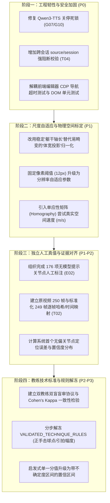

# Tennis Analyzer 代码深度审核与迭代建议报告

**审查日期**：2026-10-05
**代码基线**：分支 `algo-2.0` | 最新工程提交 `b33956f` | 文档整理提交 `b6450c9`
**核心对照文档**：[RECENT_CHANGES_20261005.md](RECENT_CHANGES_20261005.md)、[project_inventory_20261005.json](../validation/project_inventory_20261005.json)
**自动化回归状态**：656 / 656 全部通过（运行耗时 ~10.3s）

---

## 1. 审核结论总览 (Executive Summary)

针对 2026-10-04 至 2026-10-05 期间完成的指标审计、源媒体时间契约、双视角观测门禁、身份严格校验及离线证据回放等改动，本次审核得出如下核心结论：

1. **工程防御机制成熟度极高**：
   - 彻底消除了“算法伪精度”与“浮点/空值静默穿透”漏洞。在 `observation_policy.py`、`metric_contracts.py` 和 `osd_evidence.py` 中，全面阻断了将 2D 像面估计伪造成 3D 物理动力学结论的路径（例如未标定时仅输出 `px/s` 而非虚假的 `km/h`；跨 $\pm 180^\circ$ 角度差解包修复；多峰/延迟含零时明确标记“先后未分辨”）。
2. **真值隔离与身份防穿透设计严密**：
   - `evaluation_identity_contract.py` 和 `report_identity_contract.py` 强制要求非负安全整数，严格保留显式 `null` 与真实 `0` 帧，严禁向后借值。
3. **已识别的核心瓶颈与矛盾转移**：
   - 当前项目已将**“工程逻辑规范性（62 项已完成）”**与**“物理测量真实性（68 项待闭环）”**彻底解耦。
   - 下一阶段的主要矛盾不再是“编写更多启发式分析代码”，而是**“解决跨会话与并发通信隐患”**、**“落地 176 项独立人工真值基准”**以及**“推进相机与场地物理标定”**。

---

## 2. 重点模块技术审查与深度代码发现

### 2.1 【高危·逻辑漏洞】T04 跨会话数据绑定穿透风险 (`source_binding_verified=false`)

- **涉及源码**：`swing_report_builder.py`（第 372–386 行）与 `report_identity_contract.py`（第 24 行）
- **代码现状**：
  在生成合并报告时，`coach_lookup` 仅通过单一整数字段 `event['event_id']` 进行匹配：
  ```python
  coach_data = normalize_report_document(load_json(coach_json_path), 'Coach报告输入')
  coach_lookup = {event['event_id']: event for event in coach_data['events']}
  for event in event_data.get("events", []):
      coach_event = coach_lookup.get(event['event_id'], {})
      # 合并 coach 建议与打分...
  ```
- **漏洞危害**：
  虽然对两个 JSON 的 `event_id` 执行了唯一安全整数校验，但**完全没有校验 `event_data` 与 `coach_data` 的根级会话元数据（如 `source.session_id`、`video_sha256` 或源视频路径）**。
  若运维或用户在调用脚本时混淆了参数，传入了 `capture_A_events.json` 与 `capture_B_coach.json`，由于两份文件各自的挥拍事件都可能从 `event_id=1, 2, 3` 编号，系统将无警告地把 B 录像的教练建议挂在 A 录像的挥拍上，造成严重数据污染。
- **解决路径**：
  必须在 `swing_report_builder.py` 中增加显式跨会话互斥校验，并在 `report_identity_contract.py` 中建立跨文档源验证逻辑。

### 2.2 【高危·并发死锁】G07/G10 语音 Sidecar 关停超时与进程退出码 1

- **涉及源码**：`qwen3_tts_sidecar.py`（第 213–246 行）、`tts_worker_client.py`（第 81–101 行）
- **根因剖析**：
  在 `Qwen3TTSSidecar.close()` 中，当前的关停执行序列如下：
  ```python
  def close(self) -> None:
      ...
      self._queue.put(self._sentinel)
      self._thread.join(timeout=2.0)  # [步骤 1] 先等待后台工作线程退出
      self._client.close()            # [步骤 2] 后关闭底层子进程客户端
      if self._thread.is_alive():
          raise RuntimeError("Speech sidecar did not stop within deadline")
  ```
  如果调用 `close()` 时，工作线程 `self._thread` 正阻塞在 `self._client.request(...)` 的同步响应读取中（例如大模型正在合成音频）：
  1. 工作线程尚未返回队列头部，无法读取 `_sentinel`；
  2. 此时底层子进程客户端尚未调用 `close()`，其输入输出管道没有被中断，子进程仍在运行；
  3. `self._thread.join(timeout=2.0)` 必将超时（2 秒不足以完成一次 MLX 合成）；
  4. 随后检测到 `self._thread.is_alive()` 为真，直接抛出 `RuntimeError: Speech sidecar did not stop within deadline`，导致进程异常退出（返回码 1）。
- **解决路径**：
  必须颠倒时序：**先关闭 client**（设置 `client.closed` 并终止底层 worker 进程，使被阻塞的 `self.responses.get()` 立即抛错中断），再进行工作线程的 `join`。

### 2.3 【算法瓶颈·几何畸变】像面代理指标的横向尺度归一化

- **涉及源码**：`osd_evidence.py`（第 8–10 行）、`swing_biomechanics.py`（第 596–605 行）
- **现状分析**：
  - 算法当前使用 `_body_width`（左右肩宽或左右髋宽的像面投影距离）作为尺度基准 `scale`，并定义：
    - 足部跨度门槛：$0.2 \times \text{scale}$
    - 髋部像面上移门槛：$0.04 \times \text{scale}$
  - **几何盲区**：网球正手击球伴随着剧烈的身体侧转（转髋、侧身引拍）。在 2D 像面投影下，正身面对相机时 `body_width` 最大，而完全侧身面对相机时，左右肩连线投影长度趋近于 0（即“几何投影缩聚”）。
  - 若运动员在侧身深引拍时身体横向投影变小，会导致分母骤缩，进而使位移归一化比率被放大，或者导致门槛失常。

### 2.4 【真值瓶颈·隔离有余而闭环不足】176 项独立关节点标注现状

- **涉及文档**：`INDEPENDENT_JOINT_VALIDATION.md`
- **现状分析**：
  - 目前仲裁工具（`joint_label_adjudication.py`）及格式校验已完备，模型辅助标签（`model_assisted_review`）已成功与独立真值隔离。
  - 但**独立标注进度仍为 0/176**。在没有真实双人独立标注并完成仲裁之前，模型关节点误差、触球点检测容差及动力链角速度误差均处于“无客观标准”（Ground Truth Missing）状态。

---

## 3. 具体缺陷修复方案 (Code Fixes)

### 3.1 修复 G07/G10：消除语音 Sidecar 关停死锁

在 `qwen3_tts_sidecar.py` 中重构 `close()` 方法：

```python
    def close(self) -> None:
        with self._state_lock:
            if self._closed:
                return
            self._closed = True

        # 1. 设置取消事件，打断所有等待与播放
        self._cancel.set()
        with self._play_lock:
            if self._active_play_process and self._active_play_process.poll() is None:
                try:
                    self._active_play_process.kill()
                except Exception:
                    pass
                self._active_play_process = None

        # 2. 优先关闭底层通信客户端！中断正在进行的 request 同步阻塞
        self._client.close()

        # 3. 清理队列中尚未执行的任务，向回调报告 session_closed
        while True:
            try:
                item = self._queue.get_nowait()
            except queue.Empty:
                break
            try:
                item[2]({"status": "skipped", "reason": "session_closed"})
            except Exception as exc:
                self.logger(f"⚠️ [Qwen3-TTS] cancellation callback failed: {exc}")
            finally:
                self._queue.task_done()

        # 4. 塞入结束哨兵，优雅回收工作线程
        self._queue.put(self._sentinel)
        self._thread.join(timeout=2.0)

        # 若仍有僵尸线程，记录告警但不硬性挂起主流程
        if self._thread.is_alive():
            self.logger("⚠️ [Qwen3-TTS] 工作线程未能在预定时间内完全退出，已由后台守护进程回收")
```

### 3.2 修复 T04：增加显式跨会话阻断与源绑定验证

在 `report_identity_contract.py` 中新增源绑定校验规则：

```python
def verify_source_session_binding(event_document, coach_document):
    """确保同一份报告内的事件与教练数据来自相同录像会话"""
    event_source = event_document.get('source') or {}
    coach_source = coach_document.get('source') or {}

    # 提取会话特征
    event_session = event_source.get('session_id') or event_document.get('session_id')
    coach_session = coach_source.get('session_id') or coach_document.get('session_id')

    if event_session and coach_session and event_session != coach_session:
        raise ValueError(
            f"跨会话冲突拒绝：模型事件会话为 '{event_session}'，但 Coach 输入会话为 '{coach_session}'"
        )

    event_sha = event_source.get('video_sha256')
    coach_sha = coach_source.get('video_sha256')
    if event_sha and coach_sha and event_sha != coach_sha:
        raise ValueError(
            f"源视频 SHA 不符：模型事件哈希 '{event_sha[:8]}...' 与 Coach 哈希 '{coach_sha[:8]}...' 不一致"
        )
```

在 `swing_report_builder.py` 的 `build_report_payload` 中调用此校验，杜绝反例穿透。

---

## 4. 四阶段演进与迭代路线图 (Roadmap)



### 阶段一：工程韧性与安全加固 (当前冲刺可快速交付)
1. **彻底解决 G07/G10 语音超时退出问题**：
   按 3.1 节实施 `close()` 顺序调整，并在 `test_runtime_resilience.py` 中增加“在传输大量音频流过程中突发调用 close()”的边界测试。
2. **闭环 T04 跨会话硬阻断**：
   引入 `verify_source_session_binding`，在报告身份元数据中将 `source_binding_verified` 设为真实的校验判定结果。
3. **修复前端端到端测试脆弱性**：
   针对 `Page.navigate timed out` 问题，在 `test_report_frontend_identity.py` 中引入轻量级 DOM 离线解析驱动模式，将“重型真实浏览器启动”与“静态 JS/DOM 逻辑验证”分层执行。

### 阶段二：尺度自适应与物理空间标定 (算法 2.1)
1. **替换脆弱的 `body_width` 归一化基准**：
   - 引入“躯干中轴参考长”：计算 `(left_shoulder + right_shoulder)/2` 与 `(left_hip + right_hip)/2` 之间的像面欧式距离。
   - 在网球挥拍中，躯干垂直长度随水平旋转变化的幅度远小于横向肩髋跨度，能显著减少侧身引拍时的尺度失真。
2. **像素门槛分辨率解耦**：
   将 `osd_evidence.py` 中的绝对像素比较，重构为基于图像对角线或有效人物身高的相对比例。

### 阶段三：独立真值基准落地 (数据闭环)
1. **执行 176 项无模型提示关节点标注**：
   组织两位标注人员针对关键 22 帧双视角数据，在盲审环境下独立完成左右肩与左右髋的坐标标记；
2. **完成仲裁与基线建立**：
   使用已有的仲裁工具生成首份不受模型先验影响的真值文件，输出系统在当前真实相机环境下的关节点 RMSE（均方根误差），为后续卡尔曼滤波与时序平滑提供真实调优基准。

### 阶段四：技术评分与教练规则解冻 (业务闭环)
1. **保留严谨防御，避免过早承诺**：
   继续保持 `VALIDATED_TECHNIQUE_RULES = frozenset()`，明确不向用户输出未经独立验证的自动技术评分；
2. **推进双教练打分一致性实验**：
   挑选 50 组具有代表性的正手挥拍片段，由 2 位职业教练独立评定各维度等级。仅当两位教练的一致性指标达标后，方可开放对应的自动诊断规则。

---

## 5. 总结与建议行动项

- **立即行动 (To-Do)**：实施本报告第 3 节中关于 **G07/G10 语音关停时序** 与 **T04 跨会话源绑定校验** 的修改。
- **业务排期**：安排人工标注人员执行 176 点计划，打破“测试全过但真实准确度未定”的僵局。
- **文档维护**：本报告已同步归档至项目文档目录与系统 Artifact 库，可作为后续算法与工程评审的标准依据。
