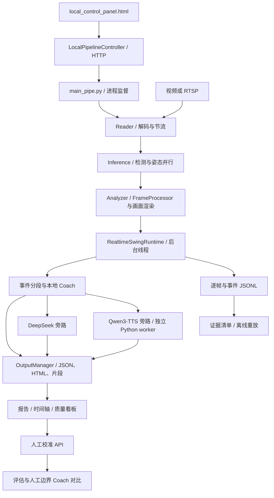

# 系统设计与算法流程

更新：2026-09-16。代码基线：`new` / `0f43470`。本文描述当前实现；优化方案见需求基线，不能视为已交付功能。

## 1. 系统边界

面向 Apple Silicon 本机、单机位网球训练分析。推荐分析入口为 `main_pipe.py`，控制入口为 `local_control_panel.py`。一个控制器管理一个分析会话；Court 01–03 是可切换的配置，并非同时运行三路分析。旧 `main.py`、TrackNet、HSV 和人脸处理模块仍留在仓库，不能据其存在推断生产默认链路使用它们。

前端采用静态 HTML、原生 JavaScript 和生成式报告；后端是 Python HTTP 服务及多进程分析，无独立数据库、React 服务或 WebSocket 服务依赖。

## 2. 运行架构



| 模块 | 职责与约束 |
| --- | --- |
| `main_pipe.py` | 共享内存、Reader/Inference/Analyzer 启停与异常监督；直播模式优先新帧 |
| `reader_runtime.py` | 帧节流与读取辅助；主流程包含断流重连配置 |
| `yolo26n_unified_detector.py` | 模型推理、候选筛选、主球与球拍选择 |
| `pose_estimator_yolo26.py` | 人体姿态、时序平滑、跳变限制及短时保持 |
| `frame_processor.py` | 汇总逐帧运动分析结果 |
| `realtime_swing_runtime.py` | 异步事件处理、日志与旁路提交；队列满时可反压 |
| `realtime_swing_pipeline.py` | 滚动事件、片段缓存、事件快照、HTML 与异步更新 |
| `manual_review_workflow.py` | 标注校验、评估、人工边界重算及对比 |

异步不等于绝对无阻塞：日志队列反压、快照复制、磁盘与共享硬件资源都可能影响时延。2026-09-20 更新：TTS 请求加入等待期限与取消；报告只保留一个待写快照。

## 3. 检测与算法链路

### 3.1 检测层

1. Reader 解码源帧；直播可丢弃过期帧，离线可按原视频 FPS 节流。
2. 按 ROI 配置裁剪球/拍检测区域；Pose 使用全帧。检测坐标恢复到原图坐标后供后续分析使用。
3. 默认检测模型为 `tennis-yolo26n-exp004-960-fp16`，letterbox 输入，类别 `ball=0`、`racket=1`，置信阈值分别为 `0.692`、`0.524`。它不承担人体类别检测。
4. 独立 `yolo26m-pose` 输出人体关键点。`ANE` 配置表达 Core ML 计算单元选择，不保证所有算子都在 ANE 执行。
5. 主球选择结合轨迹支持、速度预测、球拍距离及镜像区域惩罚；静止锚点用于抑制背景球。重捕获窗口配置为 8 帧。
6. 球拍候选结合球位置、历史连续性和镜像惩罚重排。覆盖层恢复可从已标注视频中恢复球圈和球拍框，来源保留为 `overlay_*`；这种视频不能直接用作纯检测准确率验收。

### 3.2 挥拍与触球

`swing_event_analyzer.analyze_frame_records()` 为共用聚合入口：

```text
FrameRecord → extract_motion_features → segment_swing_events
            → enrich_events_with_biomechanics → calibrate_coaching_event
            → 数据契约、质量摘要和事件输出
```

- 运动特征含腕/拍速度、加速度、球拍—球距离、contact score、双手距离和身体归一化偏移。
- 分段器平滑运动能量，选择与去重峰值，形成事件范围，细化准备起点并标记阶段。
- 触球帧优先取事件中有效 contact score 最大的帧，同分时偏向动作峰值；缺少有效分数时回退到动作峰值。因此有 `contact_frame` 不代表有可靠触球观测。
- 分类结合惯用手、机位推断、挥拍侧、持续双手证据与原始标签，保留分类规则和置信信息。当前已有机位推断逻辑，完整显式 camera profile 管理仍是后续方向。
- 实时引擎在滚动窗口中分析未提交时间线，通过结束等待及峰值去重避免重复发布；源结束时 flush 剩余有效事件。

### 3.3 帧率与时间

`analysis_interval_frames=5` 表示每 5 个已处理帧执行一次滚动分析。CLI 未指定结束等待时，主配置 `settle_frames=null` 按源 FPS 计算约 0.6 秒；控制面板默认提供 15 帧。它们与 `output_fps`、实际推理吞吐是不同概念。

15 FPS 是历史产品验收目标，不能通过设置输出视频 FPS 保证。直播丢帧时应结合源帧号、时间戳及 capture/inference/analysis/publication 时间字段分析延迟。

### 3.4 Coach 与语音

本地 `LocalRealtimeCoach` 根据证据门控生成最多 3 条建议，默认每条最多 15 字；生物力学代理指标不等于真实三维测量。球/拍证据不足应限制相应结论，不必禁止所有可靠的姿态建议。

DeepSeek 接收结构化事件和逐帧证据，异步回写 `pending/ready/failed/unavailable`，不参与确定性重放。Qwen3-TTS 只播报本地建议，经 Python 3.11 worker 流式生成并保存 WAV；浏览器音频控件播放生成文件，本机实时出声由 worker 的音频设备完成。

2026-09-20 更新：`tts_worker_client.py` 管理日志排空、响应超时、取消与进程回收；`streaming_audio_player.py` 独立消费有界音频队列。默认首请求等待 120 秒，后续请求 30 秒。关闭时取消待播任务与活动 worker；音频生成文件与实际设备播放分别验收。

## 4. 前后端功能与接口

| 页面 | 功能 |
| --- | --- |
| 控制面板 | 场地/自定义流、临时凭据、ROI 预览与显示参数、会话启停、日志、Coach/TTS/DeepSeek 开关、报告入口 |
| Live Swing Events | 事件卡片、片段、ROI 截图、Coach、音频、自动/停止刷新、质量与漂移信息 |
| 人工复核报告 | 时间轴、事件边界与触球修正、误检/漏检标注、JSON 下载与导入、评估与 Coach 对比 |

| 方法 / 路由 | 后端行为 |
| --- | --- |
| GET `/` | 控制面板 HTML |
| GET `/api/config` | 场地、默认参数、当前控制令牌 |
| GET `/api/status` | 会话状态、PID、日志、产物入口 |
| GET `/api/live-preview` | 当前会话预览图 |
| GET `/artifacts/...` | 会话文件及报告 |
| GET `/api/manual-review/state` | 指定报告的校准状态 |
| POST `/api/preview` | 按输入配置抓取 ROI 预览 |
| POST `/api/start`、`/api/stop` | 启动或停止分析 |
| POST `/api/manual-review/evaluate` | 校验标注、生成评估及满足条件时重算 Coach |

POST 需要 `X-Control-Token`；校准可用 `X-Manual-Review-Report` 定位报告。服务绑定本机回环地址。前端通过 fetch 访问后端，控制状态每秒轮询；本地预设不保存摄像头密码。停止页面刷新只停止浏览器读取，不停止后端分析。

## 5. 数据与校准闭环

每个控制台会话有独立目录和 session_id；FrameRecord、SwingEvent 及文档有版本字段。JSON/HTML 是快照，JSONL 为追加历史。证据包记录路径、尺寸、SHA-256 和重放参数，最低重放集合为 frame journal + event snapshot，遵循 ADR 0001/0002。

人工校准依次读取事件和帧日志、校验标注、写评估；完整复核条件满足后才生成人工事件和 Coach 对比。原实时事件保留。人工标注不会自动微调 YOLO、修改规则或触发 DeepSeek 重评；这些需要独立实验和验收。

## 6. 已知扩展瓶颈

2026-09-20 更新：报告待写快照由 `LatestSnapshotQueue` 合并，事件 JSONL 不合并；写错误在运行时健康检查中传播，触发既有异常监督。DeepSeek 最多保留 workers + max_pending 个任务，完成 Future 自动移除，关闭取消尚未开始的请求；视频片段也不再保留已完成 Future 列表。

仍保留完整事件历史和全量快照复制，开启旧逐帧收集时 diagnostics 列表也会增长。DeepSeek 的 HTTP socket 超时并非完整调用的墙钟硬期限，排队/请求/总延迟分别记录。大型 HTML 渲染与算法文件进一步拆分可独立进行，本轮仅抽离队列、语音进程与播放职责。
